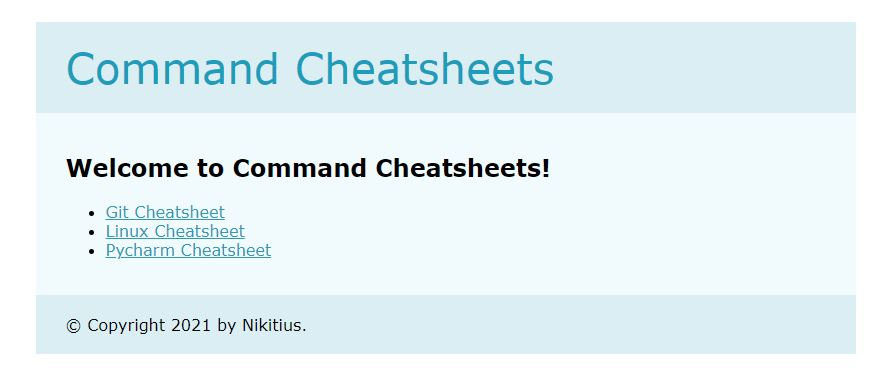
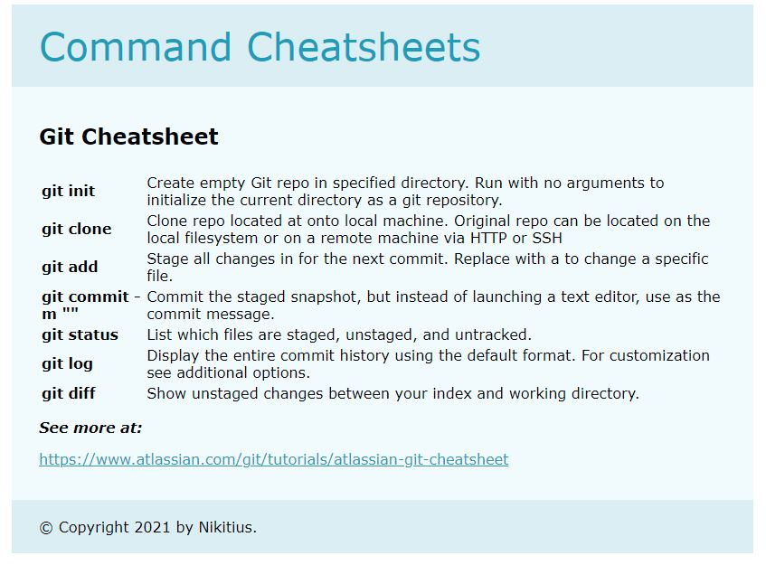

# `light_it_lektor_command_cheatsheets`

Website is built on Lektor CMS. The site contains these cheatsheets:
- Git Cheatsheet
- Linux Cheatsheet
- Pycharm Cheatsheet

## How to run

1. Go to **command_cheatsheets** folder:
    ```
    cd command_cheatsheets
    ```
2. Run lektor server:
    ```
    lektor server
    ```

## A simple example
```
..\command_cheatsheets>lektor server

Started source info update
 * Running on http://127.0.0.1:5000/ (Press CTRL+C to quit)
```

## Examples of site pages

### Homepage


### Git Cheatsheet



